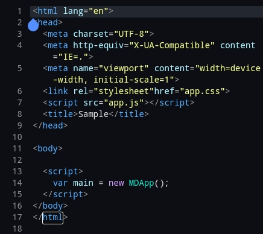

# WebMD
A javascript framework for developing mobile apps quickly.
It contains widgets,bars,toasts,etc and many more for quick app development.
It is different from Bootstrap in all respects as it provides layouts widgets,MDs,Native Widgets.
It's also highly responsive for mobile and tabs.
You just have to make a body tag and import css and js files and write all the code inside your
script tag.

Visit <a>http://webmd.rf.gd</a> Official Website for WebMD Framework.
<section>
    <h1><strong>Usage:</strong><h1/>
    <h3>Edit your html like this:</h3>
       
        <i>Now you have successfully initialized your app.</i>
        
For further instructions read our docs and practice the showcase sample

        <big style="color:red">The latest version of WebMD is only for mobile phones and Tabs</big>
